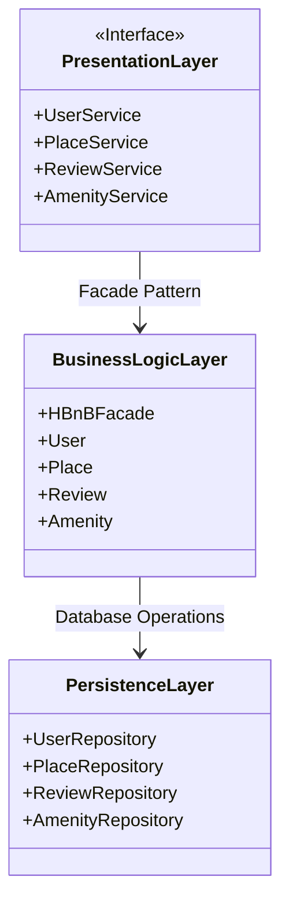

# 📘 HBnB Evolution - Technical Documentation

## 🔍 Introduction

Ce document présente l'architecture technique de l'application **HBnB Evolution**, une version simplifiée d’AirBnB.  
Il regroupe les **diagrammes UML** essentiels et des **explications détaillées** sur les composants principaux du système :

- Les services/API exposés aux utilisateurs
- La logique métier (Business Logic Layer)
- La couche de persistance (Persistence Layer)

Ce document sert de **blueprint technique** pour les phases de développement, de test et de maintenance de l’application.

---

## 🧱 High-Level Architecture (Diagramme de packages UML)

---

## Explication Diagramme de packages UML

### 1. Presentation Layer (Interface Utilisateur)
C'est la couche qui interagit avec l'utilisateur final. Elle s'appuie sur les services suivants :

#### Services disponibles :
- UserService gère toutes les informations relatives aux utilisateurs.

#### Fonctions principales :
- register_user : Enregistrer un nouvel utilisateur
- login_user : Connexion d'un utilisateur
- update_user : Mettre à jour le profil utilisateur
- delete_user : Supprimer un utilisateur

- PlaceService Gère toutes les données relatives aux logements.

#### Fonctions principales :
- create_place : Créer une annonce de logement
- update_place : Modifier les détails d’un logement
- delete_place : Supprimer un logement
- list_place : Lister tous les logements disponibles

- ReviewService Gère les avis laissés par les utilisateurs.
#### Fonctions principales :

- create_review : Laisser un avis
- update_review : Modifier un avis
- delete_review : Supprimer un avis
- list_review : Lister tous les avis

- AmenityService gère les équipements proposés dans les logements.
#### Fonctions principales :
- add_amenity : Ajouter un équipement
- update_amenity : Modifier un équipement
- delete_amenity : Supprimer un équipement
- list_amenity : Lister tous les équipements disponibles

### 2. Business Logic Layer (Logique Métier)
Cette couche contient la logique principale de l'application.

HBnBFacade
Classe centrale qui coordonne les appels aux services.
Exemples de méthodes :
- create_place(PlaceDTO)
- register_user(UserDTO)

Entités principales :
- User : représente un utilisateur (nom, prénom, e-mail, mot de passe, rôle admin ou non...)
- Place : représente un logement (titre, description, prix, emplacement...)
- Review : représente un avis (note, commentaire, auteur, lieu, date...)
- Amenity : représente un équipement (nom, description)

### 3. Persistence Layer (Accès Base de Données)
Couche qui assure la communication avec la base de données.
- UserRepository : Gère la persistance des utilisateurs
- PlaceRepository : Gère la persistance des logements
- ReviewRepository : Gère la persistance des avis
- AmenityRepository : Gère la persistance des équipements

