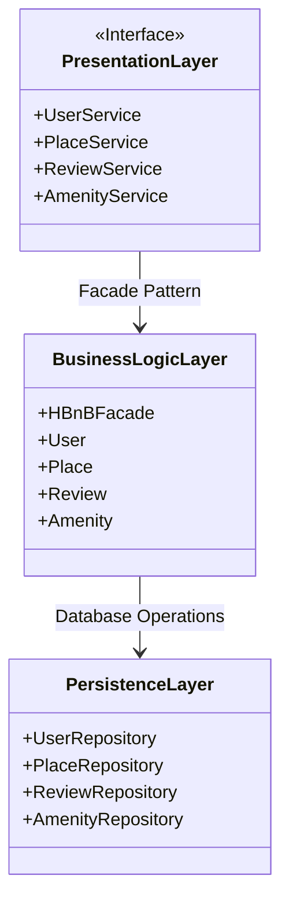
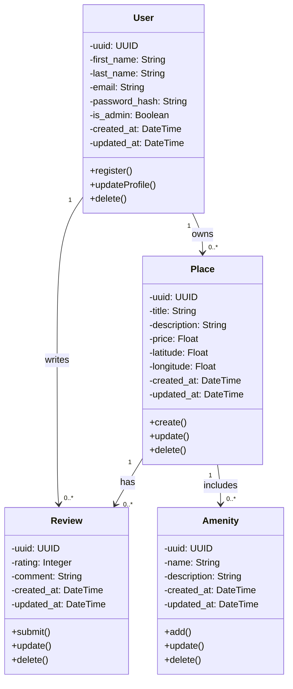
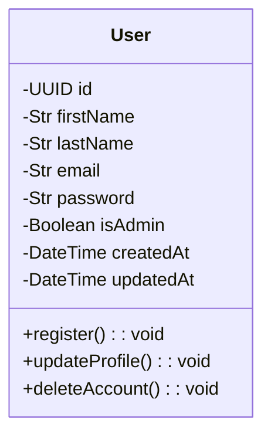
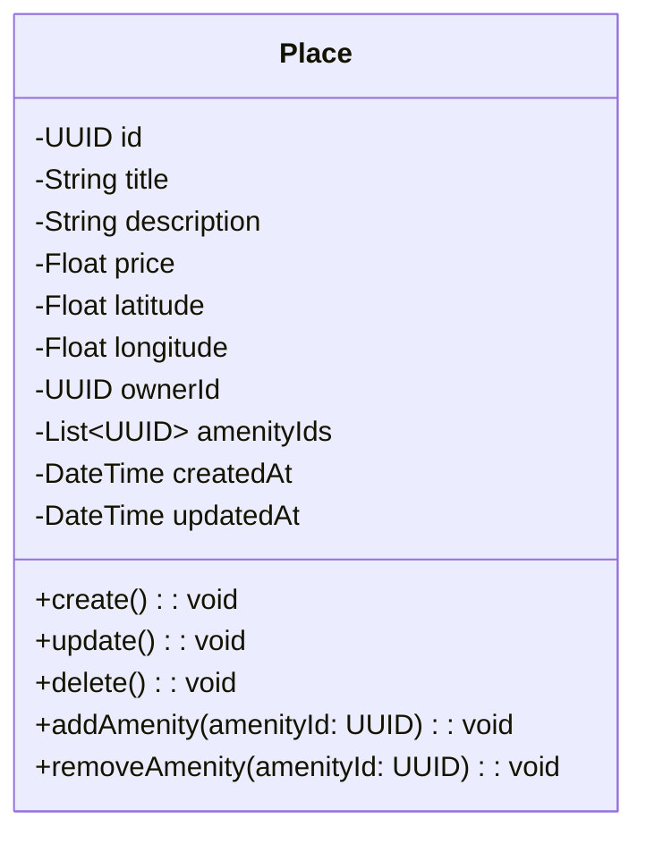
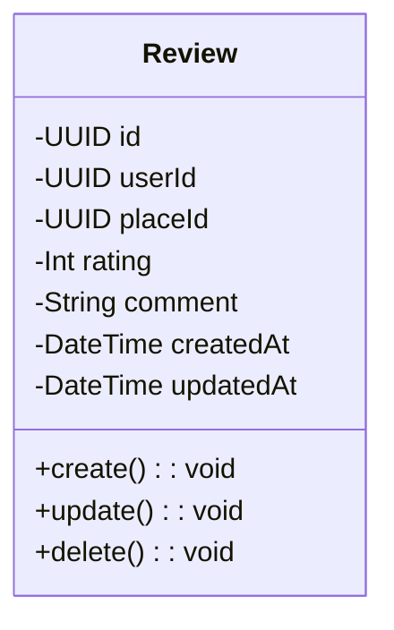
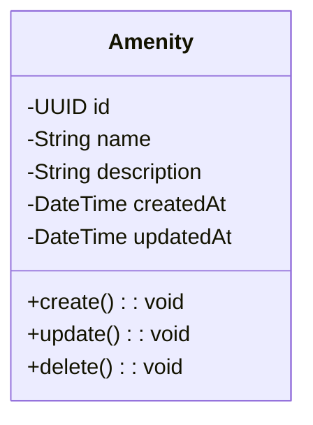

# 📘 HBnB Evolution - Technical Documentation

## 🔍 Introduction

Ce document présente l'architecture technique de l'application **HBnB Evolution**, une version simplifiée d’AirBnB.  
Il regroupe les **diagrammes UML** essentiels et des **explications détaillées** sur les composants principaux du système :

- Les services/API exposés aux utilisateurs
- La logique métier (Business Logic Layer)
- La couche de persistance (Persistence Layer)

Ce document sert de **blueprint technique** pour les phases de développement, de test et de maintenance de l’application.

---

## 🧱 High-Level Architecture (Diagramme de packages UML)

---

## Explication Diagramme de packages UML

### 1. Presentation Layer (Interface Utilisateur)
C'est la couche qui interagit avec l'utilisateur final. Elle s'appuie sur les services suivants :

#### Services disponibles :
- UserService gère toutes les informations relatives aux utilisateurs.

#### Fonctions principales :
- register_user : Enregistrer un nouvel utilisateur
- login_user : Connexion d'un utilisateur
- update_user : Mettre à jour le profil utilisateur
- delete_user : Supprimer un utilisateur

- PlaceService Gère toutes les données relatives aux logements.

#### Fonctions principales :
- create_place : Créer une annonce de logement
- update_place : Modifier les détails d’un logement
- delete_place : Supprimer un logement
- list_place : Lister tous les logements disponibles

- ReviewService Gère les avis laissés par les utilisateurs.
#### Fonctions principales :

- create_review : Laisser un avis
- update_review : Modifier un avis
- delete_review : Supprimer un avis
- list_review : Lister tous les avis

- AmenityService gère les équipements proposés dans les logements.
#### Fonctions principales :
- add_amenity : Ajouter un équipement
- update_amenity : Modifier un équipement
- delete_amenity : Supprimer un équipement
- list_amenity : Lister tous les équipements disponibles

### 2. Business Logic Layer (Logique Métier)
Cette couche contient la logique principale de l'application.

HBnBFacade
Classe centrale qui coordonne les appels aux services.
Exemples de méthodes :
- create_place(PlaceDTO)
- register_user(UserDTO)

Entités principales :
- User : représente un utilisateur (nom, prénom, e-mail, mot de passe, rôle admin ou non...)
- Place : représente un logement (titre, description, prix, emplacement...)
- Review : représente un avis (note, commentaire, auteur, lieu, date...)
- Amenity : représente un équipement (nom, description)

### 3. Persistence Layer (Accès Base de Données)
Couche qui assure la communication avec la base de données.
- UserRepository : Gère la persistance des utilisateurs
- PlaceRepository : Gère la persistance des logements
- ReviewRepository : Gère la persistance des avis
- AmenityRepository : Gère la persistance des équipements

--- 

## 💻 Sequence Diagrams for API Calls

---

# 🧬 Explication Sequence Diagrams for API Calls

Dans cette tâche, nous modélisons les **4 entités fondamentales** de l’application :

- `User`
- `Place`
- `Review`
- `Amenity`

Chaque entité comprend :
- ses **attributs**
- ses **méthodes principales**
- ses **relations avec les autres entités**
- une **représentation UML Mermaid**

---

## 👤 User

### 🔹 Attributs
Nom	                Type	    Description
- id	            UUID	    Identifiant unique (UUID4)
- first-Name	    String	    Prénom
- last-Name	        String	    Nom de famille
- email	            String	    Email unique (sert à l'authentification)
- password	        String	    Mot de passe (stocké de manière sécurisée)
- isAdmin	        Boolean	    Indique si l’utilisateur est un administrateur
- createdAt	        DateTime	Date de création du compte
- updatedAt	        DateTime	Date de dernière mise à jour

### 🔹 Méthodes
Méthode	                Description
- register()	        Enregistre un nouvel utilisateur
- updateProfile()	    Met à jour les informations utilisateur
- deleteAccount()	    Supprime le compte de l’utilisateur

---

## 🏠 Place

### 🔹 Attributs
Attribut	    Type	        Description
- id	        UUID	        Identifiant unique du logement
- title	        String	        Titre du logement
- description	String	        Description détaillée
- price	        Float	        Prix par nuit
- latitude	    Float	        Coordonnée géographique
- longitude	    Float	        Coordonnée géographique
- ownerId	    UUID	        Référence vers le User propriétaire
- amenityIds	Liste d’UUID	Liste d’équipements associés (Amenity)
- createdAt	    DateTime	    Date de création
- updatedAt	    DateTime	    Date de mise à jour

### 🔹 Méthodes
- Méthode	                    Description
- create()	                    Crée une nouvelle annonce de logement
- update()	                    Met à jour les informations du logement
- delete()	                    Supprime le logement
- addAmenity(amenityId)	        Ajoute un équipement à la liste
- removeAmenity(amenityId)	    Supprime un équipement de la liste

#### 🔗 Relations
- ownerId → 🔗 vers User
- amenityIds → 🔗 vers Amenity

---

## 📝 Review

### 🔹 Attributs
Attribut	Type	Description
- id	UUID	Identifiant unique de l’avis
- userId	UUID	Référence vers l’auteur de l’avis (User)
- placeId	UUID	Référence vers le logement concerné
- rating	Int	Note (souvent de 1 à 5)
- comment	String	Commentaire libre
- createdAt	DateTime	Date de création
- updatedAt	DateTime	Date de dernière modification

### 🔹 Méthodes
Méthode	Description
- create()	Crée un nouvel avis
- update()	Modifie un avis existant
- delete()	Supprime l’avis

### 🔗 Relations
- userId → 🔗 vers User
- placeId → 🔗 vers Place

---

## 🛋️ Amenity

### 🔹 Attributs
Attribut	Type	Description
- id	UUID	Identifiant unique de l’équipement
- name	String	Nom (ex : "Wi-Fi", "Parking", "Piscine")
- description	String	Description optionnelle
- createdAt	DateTime	Date de création
- updatedAt	DateTime	Date de dernière mise à jour

### 🔹 Méthodes
Méthode	Description
- create()	Crée un nouvel équipement
- update()	Met à jour un équipement existant
- delete()	Supprime l’équipement
